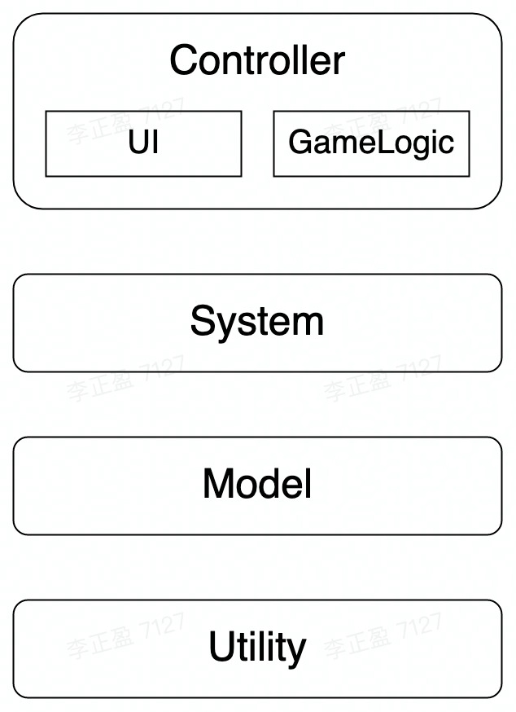
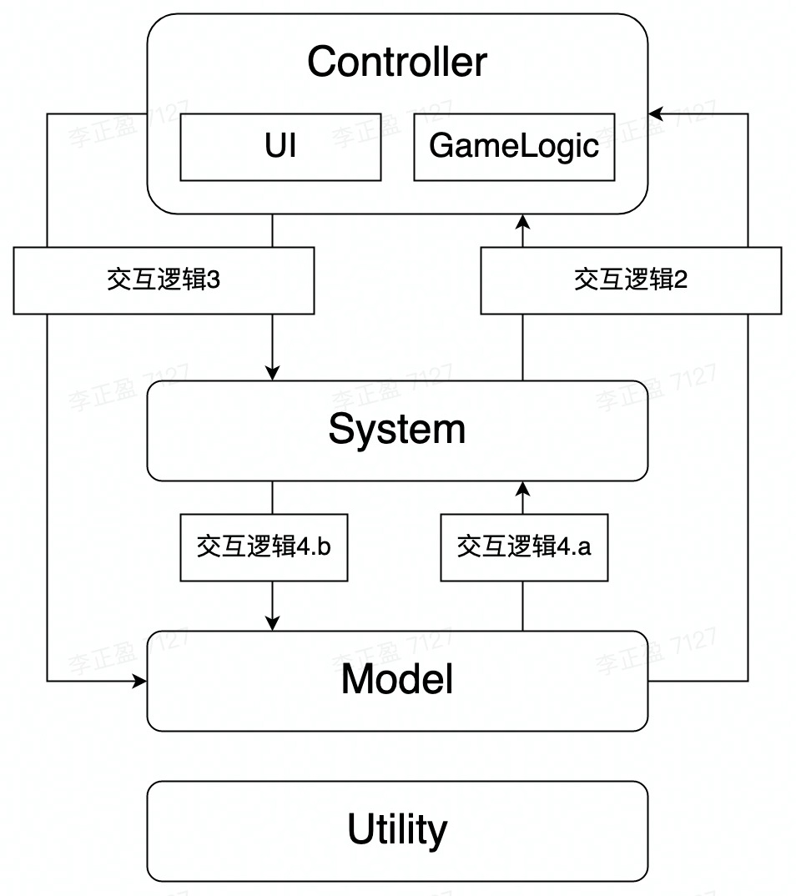
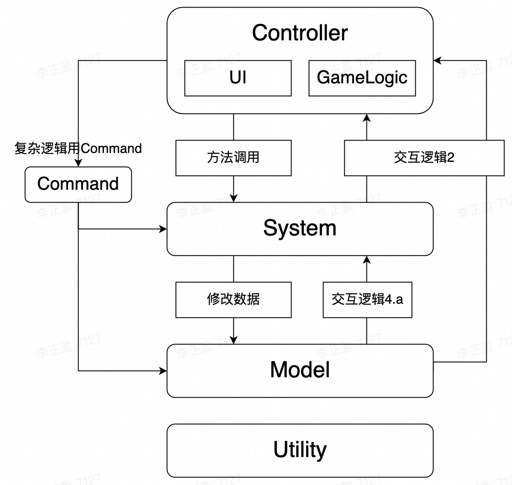
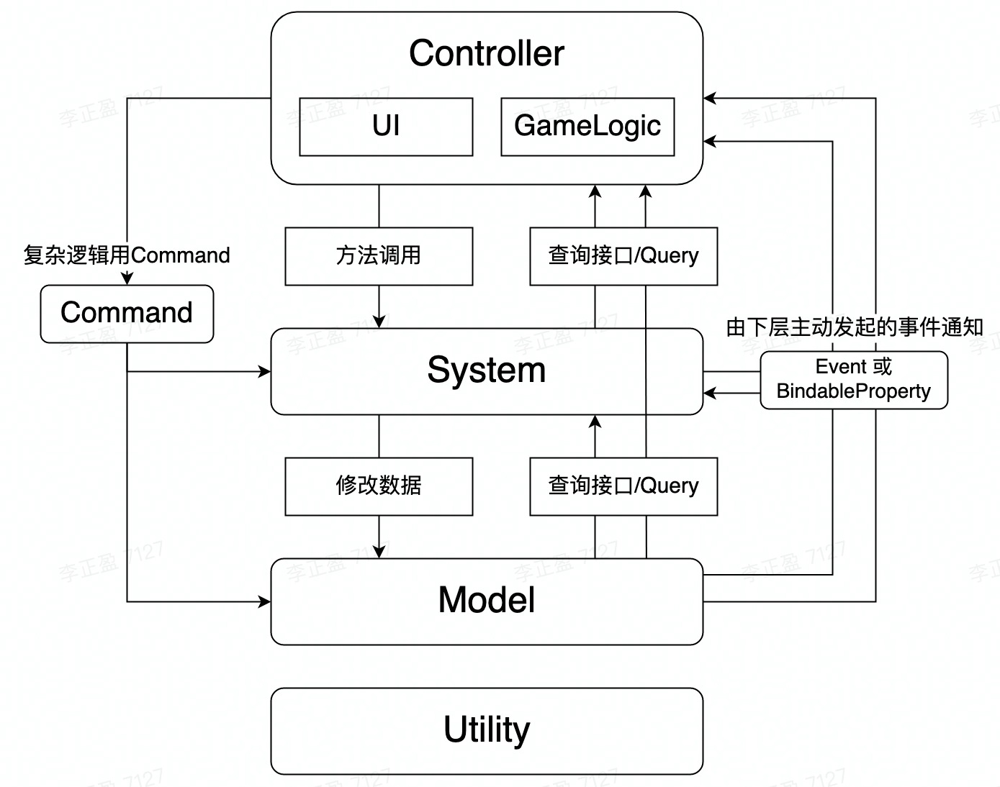

# QFramework开发框架
## 前言
[原作者教程地址](https://learn.u3d.cn/tutorial/framework_design)
### 什么是开发框架
如果把一个游戏产品比作一个装满了书的书架的话，那么开发框架就是书架本身，书架中的书本就是游戏中的各个子系统。书架提供了各种各样的空间用于存放大小不同、类型不同的各种各样的书籍。做好分类存放后我们可以方便、快捷的找到我们想要的书籍，书籍不想要了之后我们也可以随时拿出来丢掉，也不会影响其他书籍的使用。
由此可见框架本身其实体量并不大，只是提供了存放各个子系统空间的容器，同时为子系统分层分类，提供各个子系统的查找接口。在后续的开发中我们按照框架使用规则不断向框架中添加子系统，才构成了整个游戏产品架构。
一个好的开发框架应该具备的特性：**可扩展性**、**易用性**、**可伸缩性**、**容错性**、**错误感知力**
### 为什么要使用开发框架
如果做Demo我们不用框架反而会更快，不需要考虑数据流向、不需要考虑性能、不需要考虑代码可读性、不需要考虑多人协作、不需要考虑游戏的后期维护和功能扩展。
但当我们进行正式开发的时候，上述问题就是必须要考虑的了。使用统一的框架可以统一一些大方向上的问题，强制使用者对业务需求进行层级划分，同时规定每个层级对象的权限和功能。
但是仍有一些习惯和思想上的问题需要统一，这些是框架无法约束的。
### 习惯问题
**需求分层与模块化：**
这个后面介绍框架的时候会讲到。
**复杂业务逻辑拆分与通用：**
比如说一个购买皮肤的逻辑，我们有两个界面点击按钮之后需要调用这段逻辑。复制两段相同的代码放在两个UI界面显示逻辑中明显是不合理的。增加UI界面组件的代码量，更不利于多人协作（别人不知道有两个地方），那不如就放在皮肤系统或商城系统里面。
思考一下，是不是每次我们在复制一段代码的时候都应该考虑一下有没有一种方式可以把这段代码通用起来，改成调用接口的方式。
**表现层逻辑拆分与组件化：**
经常可以看到一个Board或者Dialog的代码多达几百行，这里面大部分都是业务逻辑的代码，但也不排除还有好多UI显示层面的代码，而且在另一个界面可以看到同样的代码。
跟业务逻辑一样，这些重复的UI层面的代码也同样可以独立成组件的形式通用起来，需要用的时候把组件拖拽到相应的节点上就行了。
比如说：按钮音效、动态加载显示图片资源、用户资产信息展示等。
**其他细节：**
写注释、待讨论补充

## QFramework框架介绍

### 构成
#### 表现层（Controller）
表现层包含了**UI**和**GameLogic**，其中**UI**指的是界面元素（商店界面、购买弹窗、游戏界面等），而**GameLogic**则是一些涉及玩法的组件（比如角色、敌人、卡牌、场景元素等），简而言之在Cocos中只要是继承自cc.component的组件全部属于Controller层。
这些组件的主要责任就是负责**展示数据**和**刷新数据**，同时还要负责处理用户的一部分**输入操作**（点击按钮、拖动摇杆等），并将操作和业务逻辑连接起来。
#### 系统层（System）
系统层的主要任务就是利用用户**私有数据**、**配置文件**以及系统内部的**临时数据**来处理各种业务逻辑，包括但不限于战斗系统、商城系统、皮肤系统、道具系统、时间系统、登录系统、启动系统等。
由策划提出一个功能模块往往就对应一个系统，而在开发过程中我们往往还会发现一些“隐形”的系统。比如在处理登陆流程的时候往往会涉及很多回调，这里就可以尝试把复杂的登陆流程交给登录系统来维护。不论系统内部如何实现业务逻辑，在外部看来都只是调用了登陆接口，然后传入了一个回调函数而已。
同时也要明确，系统和表现**不是**一对一或者一对多的关系，而是多对多的关系。一个界面的展示往往会引用到一个或多个系统的数据。
#### 数据层（Model）
数据层主要负责处理用户私有数据，提供增、删、改、查接口，这些数据往往来源于服务器或本地数据，主要负责记录玩家的游戏进度。
数据层还要负责处理游戏相关的配置文件，包括但不限于武器配置、敌人配置、关卡配置等。数据层提供这些配置文件的加载、解码、初始化，提供相应的查询接口。
数据层不包含任何业务逻辑，提供的增、删、改接口也应该全部由外部调用。
#### 工具层（Utility）
工具层主要负责提供通用基础服务，不依赖于任何数据层的数据或系统层的业务逻辑，理论上这些服务可以应用于任何项目中。
工具层是后续开发中应该主要积累并进行扩展的部分以提高开发效率，如：MathUtil、StringUtil、HttpUtil、PoolManager、ResManager等工具。
### 交互规则
在规定交互规则之前我们先看一下可能存在交互的层级有哪些、以及数据的流向。
1. **所有层级**都需要**Utility**层提供的基础服务，表现为上层调用Utility层的服务接口。
2. **Controller**层需要展示数据，因此Controller层和**System层**、**Model层**存在交互，数据流向表现为**下层流向上层**，这里还要分为两种情况
   1. Controller主动查询下层数据。
   2. 下层数据发生更改时通知Controller层，Controller层被动接收并刷新。
3. **Controller层**还需要处理用户的输入，即执行对应的业务逻辑。
4. **System层**需要依赖数据执行业务逻辑、同时也可以修改数据，因此System层和**System层**、**Model层**存在交互：
   1. System主动**查询**System层数据和Model层数据。
   2. System主动**修改**System层数据和Model层数据。
5. **System层**数据发生变化时还要通知**Controller层**（2.1中的一种）。
6. **Model层**数据发生变化时同样也要通知**Controller层**和**System层**（2.1中的另一种）
大致存在的交互逻辑如下图所示，**自下而上**的箭头可以理解为**数据流向**，**自上而下**的箭头可以理解为**业务逻辑**修改数据的过程。


#### 自上而下的业务逻辑
业务逻辑主要的实现方式表现为自上而下的方法调用，根据业务逻辑复杂程度的不同可以大致分为三类
##### 方法调用
* 业务逻辑**简单**时（一到两行代码就可以解决），可以直接将业务逻辑写到交互方法中（点击按钮调用的方法），这时主要表现为**Controller层**直接修改**Model层**数据。
> 这种逻辑多存在于Demo中，正式开发时建议都通过System层隔离Controller层和Model层，避免UI直接修改Model数据。
* 业务逻辑**相对复杂**时（一到两行代码无法解决），则需要考虑是否将业务逻辑移植到现有System中，或独立出新的System。这时表现为**Controller层**直接调用**System层**接口来处理业务逻辑。
##### Command命令
* 业务逻辑**更复杂**时（需要调用多个System接口、发送相应事件），则需要引入**Command（命令）**的概念，通过**Command（命令）**将复杂的业务逻辑封装起来。
> **CQRS模式**全称**Command Query Responsibility Segration**，即**命令查询指责分离模式**。
其基本思想在于，任何一个对象的方法都可以分为两大类：
**命令(Command)**：不返回任何结果，但会改变对象的状态。
**查询(Query)**：返回结果，但是不会改变对象的状态，对系统没有副作用。
*使用CQRS模式可以将复杂的业务逻辑拆分到Command和Query两逻辑对象中，减少系统层业务逻辑代码的同时实现逻辑复用。*

优化后的业务逻辑如下图所示：


#### 自下而上的数据查询
数据查询逻辑包含了**主动查询**和**被动等待通知**两种。
##### 查询和Query
**主动查询逻辑**大多存在于UI界面或角色刚刚生成时的初始化方法，用于初始化表现信息：
* 查询逻辑**简单**时，可以直接通过**调用下层数据查询接口**来获取对应的数据。
* 查询逻辑**复杂**时，可以通过上述**Query**的形式来获取。
> 当所依赖的数据并不存在于System或Model中，而是通过多个数据进行逻辑运算最后得出的结果，这种数据的获取方法直接写在Model中会增加代码量导致可读性变差，写在Controller或System中不但会增加代码量，而且复用性又很低。
##### Event和Bindable Property
**被动等待通知**大多存在于UI界面的刷新。UI界面在第一次初始化完成后并不是一成不变的，通过Update每一帧都去查询数据然后修改UI显示显然是不可取的。这里就需要使用到Event(事件系统)和Bindable Property(数据观察者)。
* **Event(事件系统)**：即全局事件通知系统，被观察者从对象变成了指定事件类型。
  * 优点：对数据类型没有特殊要求，方便快捷。
  * 缺点：需要定义大量事件类型，无法为每一个数据项定义一个类型来监听数据的变化。
* **Bindable Property(数据观察者)**：将数据抽象成被观察者对象，数据发生变化时通知观察者。
  * 优点：无需定义事件类型。
  * 缺点：需要使用特定的Bindable Property数据类型，比基础数据类型占用更多空间。

**Bindable Property（数据观察者）**
```
export class BindableProperty<T>{

    public constructor(defaultValue: T) {
        this.value = defaultValue;
    }

    private _value: T = null;

    public get value(): T {
        return this._value;
    }

    private mOnValueChanged: Delegate<T> = null;

    public set value(v: T) {
        if (this._value == v) {
            return;
        }
        this._value = v;

        // invoke when value changed
        this.mOnValueChanged?.invoke(this._value);
    }
}
```
>**Event 还是 Bindable Property？**
某一个或几个数据可能会频繁修改，而其展示界面常驻，这种情况下可以选择使用Bindable Property，比如：金币数量、游戏内倒计时、游戏分数等。
数据的修改依赖关键事件，当某一关键事件触发引起了多个数据发生变化，这种情况下可以使用Event，比如：游戏结算、解锁皮肤、敌人死亡、战斗胜利等。
注意：定义事件类型的时候要从事件角度出发，不要为了监听某一数据的变化而单独定义事件

优化后的数据查询如下图所示：



### 权限管理
**Contorller层权限**
- 获取System、获取Model、获取Utility
- 发送Command、执行Query
- 监听、取消监听事件
  
**System层权限**
- 获取System、获取Model、获取Utility
- 发送Command、执行Query
- 监听、取消监听、发送事件

**Model层权限**
- 获取Model、获取Utility
- 发送事件

**Utility层权限**
- 获取Utility
  
**Command权限**
- 获取System、获取Model、获取Utility
- 发送Command、执行Query
- 发送事件

**Query权限**
- 获取System、获取Model、获取Utility
- 执行Query