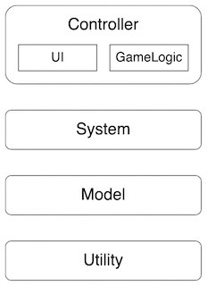

# QFramework框架设计理念
## 架构分层

### Controller（表现层）
表现层包含了**UI**和**GameLogic**，其中UI指的是界面元素（商店界面、购买弹窗、游戏界面等），而GameLogic则是一些涉及玩法的组件（比如角色、敌人、卡牌、场景元素等），简而言之在Cocos中只要是继承自cc.component的组件全部属于Controller层。
这些组件的主要责任就是负责**展示数据**和**刷新数据**，同时还要负责处理用户的一部分**输入操作**（点击按钮、拖动摇杆等），并将操作和业务逻辑连接起来。
### System（系统层）
系统层的主要任务就是利用用户**私有数据**、**配置文件**以及系统内部的**临时数据**来处理各种业务逻辑，包括但不限于战斗系统、商城系统、皮肤系统、道具系统、时间系统、登录系统、启动系统等。
### Model（数据层）
数据层主要负责处理用户**私有数据**，提供**增、删、改、查**接口，这些数据往往来源于服务器或本地数据，主要负责记录玩家的游戏进度。
数据层还要负责处理游戏相关的**配置文件**，包括但不限于武器配置、敌人配置、关卡配置等。数据层提供这些配置文件的**加载、解码、初始化**，提供相应的查询接口。
数据层**不包含**任何**业务逻辑**，提供的增、删、改接口也应该全部由**外部调用**。
### Utility（工具层）
工具层主要负责提供通用**基础服务**，不依赖于任何数据层的数据或系统层的业务逻辑，理论上这些服务可以应用于任何项目中，是未来开发过程中需要主要扩充的部分
## 使用规则
* Controller更改System、Model的状态最好使用Command、或调用System的方法。严格避免在Controller中出现业务逻辑相关代码。
* System、Model状态发生变更后通知Controller、System必须用Event或BindableProeprty
* Controller可以获取System、Model对象来进行数据查询
* Command、Query不能有状态，即不能存在临时数据
* 上层可以直接获取下层对象，下层不能获取上层对象